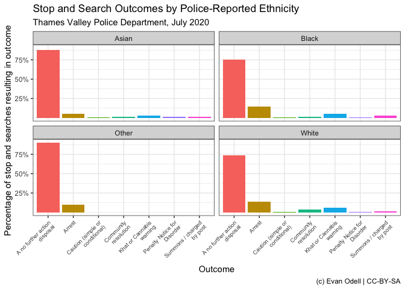

<!-- README.md is generated from README.Rmd. Please edit that file -->

[](https://www.tidyverse.org/lifecycle/#experimental)

[](https://opensource.org/licenses/MIT)
[](https://travis-ci.org/evanodell/ukpolice)
[](https://ci.appveyor.com/project/evanodell/ukpolice)
[](https://codecov.io/github/evanodell/ukpolice?branch=master)
[](https://cran.r-project.org/package=ukpolice)
[](https://github.com/evanodell/ukpolice)
[](https://dgrtwo.shinyapps.io/cranview/)
[](https://zenodo.org/badge/latestdoi/178673884)

# ukpolice

The `ukpolice` package downloads data from the UK Police public data
API, the full docs of which are available at
<https://data.police.uk/docs/>.

Data is available on police forces, crimes, policing areas and
stop-and-search. All functions begin with `ukc_`.

The example below queries stop and searches by the Thames Valley Police
in December 2018, and plots them by police-reported ethnic group.

``` r
library(ukpolice)
library(ggplot2)
library(dplyr)

tv_ss <- ukc_stop_search_force("thames-valley", date = "2018-12")

tv_ss2 <- tv_ss %>% 
  filter(!is.na(officer_defined_ethnicity) & outcome != "" ) %>%
  group_by(officer_defined_ethnicity, outcome) %>%
  summarise(n = n()) %>%
  mutate(perc = n/sum(n))

p1 <- ggplot(tv_ss2, aes(x = outcome, y = perc,
                             group = outcome, fill = outcome)) + 
  geom_col(position = "dodge") + 
  scale_y_continuous(labels = scales::percent,
                     breaks = seq(0.25, 0.8, by = 0.25)) + 
  scale_x_discrete(labels = scales::wrap_format(15)) + 
  theme(legend.position = "none", axis.text.x = element_text(size = 8)) + 
  labs(x = "Outcome", 
       y = "Percentage of stop and searches resulting in outcome",
       title = "Stop and Search Outcomes by Police-Reported Ethnicity",
       subtitle = "Thames Valley Police Department, December 2018",
       caption = "(c) Evan Odell | 2019 | CC-BY-SA") + 
  facet_wrap(~officer_defined_ethnicity)

p1
```


