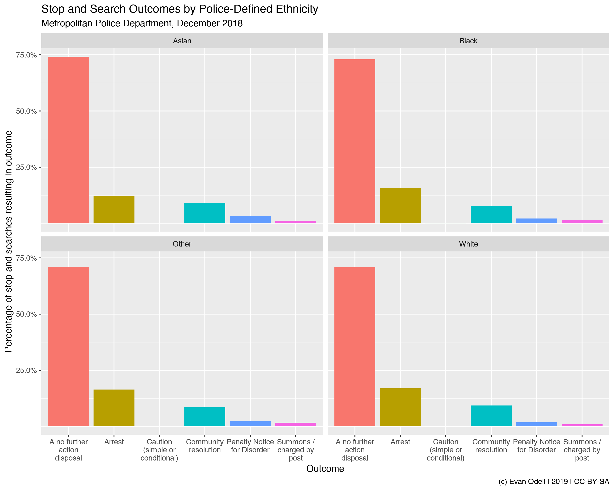

```{r setup, include = FALSE}
knitr::opts_chunk$set(
  collapse = TRUE,
  comment = "#>"
)
```

The `ukpolice` package downloads data from the UK Police public data API, the full docs of which are available at https://data.police.uk/docs/.

The API uses a 'leaky bucket' rate limiter, which allows for 15 requests per second with a burst of 30. This allows for 15 requests each second, but up to 30 in a single second at one go. The API does not require authentication.

Data is available on police forces, crimes, policing areas and stop-and-search. All functions begin with `ukc_`.

The example below queries stop and searches by the Metropolitan Police in December 2018, and plots them by police-reported ethnic group.

```{r stop-search-london, eval=FALSE}
library(ukpolice)
library(ggplot2)
library(dplyr)

london_ss <- ukc_stop_search_force("metropolitan", date = "2018-12")

london_ss2 <- london_ss %>% 
  filter(!is.na(officer_defined_ethnicity)) %>%
  group_by(officer_defined_ethnicity, outcome) %>%
  summarise(n = n()) %>%
  mutate(perc = n/sum(n))


p1 <- ggplot(london_ss2, aes(x = outcome, y = perc,
                             group = outcome, fill = outcome)) + 
  geom_col(position = "dodge") + 
  scale_y_continuous(labels = scales::percent,
                     breaks = seq(0.25, 0.8, by = 0.25)) + 
  scale_x_discrete(labels = scales::wrap_format(15)) + 
  theme(legend.position = "none") + 
  labs(x = "Outcome", 
       y = "Percentage of stop and searches resulting in outcome",
       title = "Stop and Search Outcomes by Police-Defined Ethnicity",
       subtitle = "Metropolitan Police Department, December 2018",
       caption = "(c) Evan Odell | 2019 | CC-BY-SA") + 
  facet_wrap(~officer_defined_ethnicity)

p1
```


```{r stop-search-plot, echo=FALSE, out.width = '100%'}

```

We can also map crimes tied to particular locations. In the map below, you can see all crimes reported in Cambridge in September 2018, with markers indicating the approximate location.

```{r crime-map-cantab, out.width='100%', fig.height=5, fig.align='center'}
library(leaflet)
library(htmltools)
library(ukpolice)

crime_poly <- ukc_street_crime(
   lat = c(52.263, 52.273073, 52.134836, 52.135468),
   lng = c(0.01854, 0.327187, 0.314484, -0.011329),
   date = "2018-09"
)

crime_poly$location$longitude <- as.numeric(crime_poly$location$longitude)
crime_poly$location$latitude <- as.numeric(crime_poly$location$latitude)

labels <- paste0(
  "<strong>Category:</strong> ", crime_poly$category,"</br>",
  "<strong>Outcome:</strong>  ", crime_poly$outcome_status$category, "</br>",
  "<strong>Street Description:</strong>  ", crime_poly$location$street$name
) %>% lapply(htmltools::HTML)

map <- leaflet(options=leafletOptions(
  maxBounds = list(list(0.48,-0.05), list(52.3,52.1)), minZoom = 4)) %>%
  addTiles() %>% 
  addCircleMarkers(lng = crime_poly$location$longitude, 
             lat = crime_poly$location$latitude,
             popup = labels,
             clusterOptions = markerClusterOptions())

map
```


